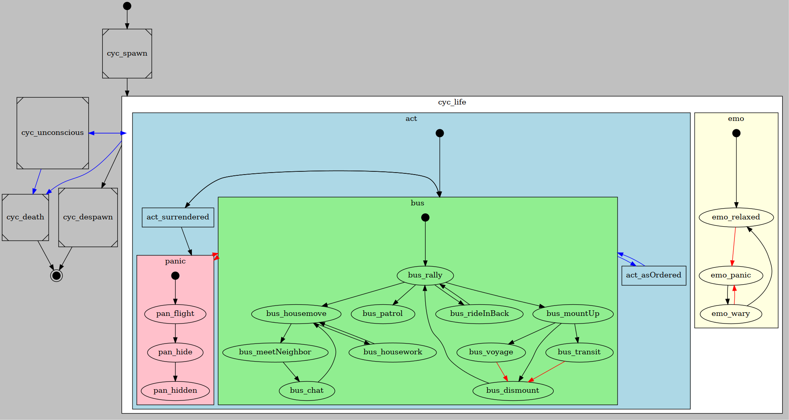

# GRAD Civilians

Spawn ambient civilians on the map.

## Features

* civilians patrol and drive around the country, alone and in small groups
* stop and raise their hands when threatened with weapons
* will panic and flee in firefights
* will move out of player's way when getting honked at
* civilian players will get hints as to what a "grad-civ" civilian would notice (like, being pointed at with a gun, told to go away by ACE interact, ...)

## Dependencies

* [CBA_A3](https://github.com/CBATeam/CBA_A3)
* [ACE3](https://github.com/acemod/ACE3)

## Installation
### Manually
1. Create a folder in your mission root folder and name it `modules`. Then create one inside there and call it `grad-civs`.
2. Download the contents of this repository ( there's a download link at the side ) and put it into the directory you just created.
3. Append the following lines of code to the `description.ext`:

```sqf
class CfgFunctions {
    #include "modules\grad-civs\cfgFunctions.hpp"
};
```


### Via `npm`
_for details about what npm is and how to use it, look it up on [npmjs.com](https://www.npmjs.com/)_

1. Install package `grad-civs` : `npm install --save grad-civs`
2. Prepend your mission's `description.ext` with `#define MODULES_DIRECTORY node_modules`
3. Append the following lines of code to the `description.ext`:

```sqf
class CfgFunctions {
    #include "node_modules\grad-civs\cfgFunctions.hpp"
};
```

## Usage Notes

To avoid micro lags / fps dips on the server, it is recommended to add a headless client (no configuration needed for that).

If that is not possible, civilian group size (looking at you, [Ikraus 260](https://de.wikipedia.org/wiki/Ikarus_260)!) as well as total population count should be kept small.

Civilians on separate islands can run into pathing problems. Avoid by creating exclusion zones.


## Config
Add the class `cfgGradCivs` to your `description.ext`. Use the following attributes to configure the module:

### Attributes

Attribute                | Default Value | Explanation
-------------------------|---------------|------------------------------------------------------------------------------------------------------------------------------------------------
autoInit                 | 0             | Toggles on automatic initialization of module on missions start (0/1). Keep this off if you want to use functions to set civs properties first.
automaticVehicleGroupSize| 1             | Allow vehicles to be filled according to capacity, ignoring *initialGroupSize* (0,1).
backpackProbability      | 50            | Probability that a civilian will wear a backpack, in percent
backpacks                | []            | All classnames of backpacks that civilians may wear.
civClass                 | "C_Man_1"     | Unit class to use for spawning civilians
clothes                  | []            | All classnames of clothes that civilians may wear.
debugCivState            | 0             | Toggles civ behavior debugging mode (0/1).
debugFps                 | 0             | Toggles fps monitoring mode (0/1).
enableInVehicles         | 1             | Enable civilians in vehicles (0/1).
enableOnFoot             | 1             | Enable civilians on foot (0/1).
exitOn                   | ""            | Condition upon which grad-civs loops will stop.
faces                    | []            | All classnames of faces that civilians may have.
goggles                  | []            | All classnames of goggles that civilians may wear.
headgear                 | []            | All classnames of headgear that civilians may wear.
initialGroupSize         | 3             | Initial group size for civilians, between 1..N . Value may be any valid parameter to the `random` command.
maxCivsInVehicles        | 10            | Maximum number of civs in vehicles.
maxCivsOnFoot            | 30            | Maximum number of civs on foot.
maxCivsResidents         | 20            | Maximum number of civs that are residents, mostly doing their thing at home.
minCivUpdateTime         | 2             | Spawn new civilians only if their beheviour states get updated at least every N seconds. NOTE: each frame only one civ gets updated. Example: With 40fps and minCivUpdateTime=2, not more than 80 civs will be alive at any given time. This setting is meant to prevent civs from becoming too unresponsive.
minFps                   | 40            | Spawn new civilians only if fps are at or above N . NOTE: the fps are taken from the machine that spawns the civs, which may be a HC.
onHeldUp                 | ""            | Code to execute when civilian stops because a weapon is pointed at him. Passed parameters are: [civilian].
onKilled                 | ""            | Code to execute when civilian is killed. Passed parameters are: [civilian,killer].
onSpawn                  | ""            | Code to execute on civilian spawn. Passed parameters are: [civilian,vehicle (objNull if on foot)].
panicCooldown            | [15,120,240]  | Time it takes until a civilian relaxes after panicking (trivariate: [lowest, median, highest])
spawnDistancesInVehicles | [1500,6000]   | Minimum and maximum distance to players that civilians in vehicles can spawn in.
spawnDistancesOnFoot     | [1000,4500]   | Minimum and maximum distance to players that civilians on foot can spawn in.
spawnDistancesResidents  | [500, 1000]   | Minimum and maximum distance to players that civilians living in houses spawn in.
vehicles                 | ["C_Van_01_fuel_F", "C_Hatchback_01_F", "C_Offroad_02_unarmed_F", "C_Truck_02_fuel_F", "C_Truck_02_covered_F", "C_Offroad_01_F", "C_SUV_01_F", "C_Van_01_transport_F", "C_Van_01_box_F"]            | All classnames of vehicles that civilians may drive.

### Example

```sqf
class CfgGradCivs {
    autoInit = 1;
    maxCivsOnFoot = 20;
    maxCivsResidents = 30;
    maxCivsInVehicles = 10;
    spawnDistancesOnFoot[] = {1000,4500};
    spawnDistancesInVehicles[] = {1000,4500};
    debugCivState = 0;
    debugFps = 0;
    minCivUpdateTime = 3;
	minFps = 35;
    automaticVehicleGroupSize = 1;
    exitOn = "";
    onSpawn = "systemChat format ['%1 spawned', typeOf (_this select 0)];";
    onHeldUp = "";    
    backpackProbability = 0.5;

    clothes[] = {
        "rds_uniform_Worker1",
    	"rds_uniform_Worker2"
    };

    headgear[] = {
        "rds_Villager_cap1",
    	"rds_Villager_cap2"
    };

    faces[] = {
        "PersianHead_A3_01",
    	"PersianHead_A3_02",
    	"PersianHead_A3_03"
    };

    goggles[] = {
        "TRYK_Beard_BK",
       	"TRYK_Beard_BK2",
        "TRYK_Beard_BK3"
    };

    backpacks[] = {
        "rhs_sidor"
    };
};
```

## Events

### custom activity

To let civilians break from their usual activity and do something else, you can use events:

This will make the civilian available to be given custom commands without interference from grad-civs:

`["GRAD_civs_customActivity_start", [_civ], _civ] call CBA_fnc_targetEvent;`

To end the custom activity and make the civ resume their normal stuff, fire another event:

`["GRAD_civs_customActivity_end", [_civ], _civ] call CBA_fnc_targetEvent;`

**NOTE**: this whole thing will *NOT* work while they are panicking.

## Functions

All functions meant for use from outside sit in the `/functions/api` directory.

### grad_civs_fnc_setClothes
Sets all clothes that civilians may wear. Overwrites `cfgGradCivs` value. Effect is global.

#### Syntax
`[clothes] call grad_civs_fnc_setClothes`

Parameter | Explanation
----------|-----------------------------------------------------------
clothes   | Array - All classnames of clothes that civilians may wear.

### grad_civs_fnc_setFaces
Sets all faces that civilians may have. Overwrites `cfgGradCivs` value. Effect is global.

#### Syntax
`[faces] call grad_civs_fnc_setFaces`

Parameter | Explanation
----------|---------------------------------------------------------
faces     | Array - All classnames of faces that civilians may have.


### grad_civs_fnc_setGoggles
Sets all goggles that civilians may wear. Overwrites `cfgGradCivs` value. Effect is global.

#### Syntax
`[goggles] call grad_civs_fnc_setGoggles`

Parameter | Explanation
----------|-----------------------------------------------------------
goggles   | Array - All classnames of goggles that civilians may wear.

### grad_civs_fnc_setHeadgear
Sets all headgear that civilians may wear. Overwrites `cfgGradCivs` value. Effect is global.

#### Syntax
`[headgear] call grad_civs_fnc_setHeadgear`

Parameter | Explanation
----------|-----------------------------------------------------------
headgear  | Array - All classnames of clothes that civilians may wear.

### grad_civs_fnc_setBackpacks
Sets all backpacks that civilians may wear and sets probability. Overwrites `cfgGradCivs` value. Effect is global.

#### Syntax
`[backpacks,probability] call grad_civs_fnc_setHeadgear`

Parameter   | Explanation
------------|-----------------------------------------------------------------------
backpacks   | Array - All classnames of clothes that civilians may wear.
probability | Number - Probability that civilian will wear a backpack. Default: 0.5.

### grad_civs_fnc_setVehicles
Sets all vehicles that civilians may drive. Overwrites `cfgGradCivs` value. Effect is global.

#### Syntax
`[vehicles] call grad_civs_fnc_setVehicles`

Parameter | Explanation
----------|-------------------------------------------------------------
vehicles  | Array - All classnames of vehicles that civilians may drive.

### grad_civs_fnc_setDebugMode
Sets debug mode. Overwrites `cfgGradCivs` value. Effect is global.

#### Syntax
`[debugCivState] call grad_civs_fnc_setDebugMode`  

Parameter     | Explanation
--------------|--------------------------
debugCivState | Bool - Debug mode on/off.

### grad_civs_fnc_initModule
Used to manually initialize module. Has to be executed on all machines. Effect is local.

#### Syntax
`[] call grad_civs_fnc_initModule`  
`[] remoteExec ["grad_civs_fnc_initModule",0,true]`

Parameter | Explanation
----------|-----------------------------------------------------------
headgear  | Array - All classnames of clothes that civilians may wear.

### grad_civs_fnc_populateArea
Manually populates an area with civilians. These civilians count towards the maximum amount.

#### Syntax
`[area,amount,excludeFromCleanup,staticVehicles,staticVehiclesMax] call grad_civs_fnc_populateArea`

Parameter                     | Explanation
------------------------------|-------------------------------------------------------------------------------------------------------------------------------------------------
area                          | Array / Object - Area array in format `[a, b, angle, isRectangle]` or array of area arrays or gamelogic synchronzed to one or multiple triggers.
amount                        | Number - Amount of civilians to spawn.
excludeFromCleanup (optional) | Bool - Sets if these civilians will be excluded from cleanup when no players are near. (default: true)
staticVehicles (optional)     | Bool - Sets if static vehicles will be created in the area. (default: false)
staticVehiclesMax (optional)  | Number - Maximum amount of static vehicles to create. Actual amount is based on number of roads and houses in area.


### grad_civs_fnc_addExclusionZone

Prevent civilians from entering an area.

*known issues: pathing through area is not checked. To minimize that problem, define exclusionZones with large diameter.*

#### Syntax

`[_trigger] call grad_civs_fnc_addExclusionZone;`  

## Development

* we're using the CBA state machine implementation, see `/functions/sm_*/`
* if you add states or transitions, please update the DOT files in `/docs`
    * which is where you'll find the compiled SVG files, too.
    * install [Graphviz](https://graphviz.gitlab.io/) and generate them using `dot -Tsvg states.gv > states.svg` or use an online editor   

### state stot wot?

worry not, here comes a friendly introduction:

**CBA state machine for dummies**

#### what are state machines

A state machine is a construct made of states and transitions between states. It can be visualized very easily as a directed graph with nodes (states) and edges (transitions). The state machine gets fed with a bunch of entities that inhabit the states. It periodically checks the states and moves the entities along the transitions from one state to the next.

#### how do they look like with CBA

Let's have a very simple example:

```sqf
MY_CIV_LIST = ["C_Offroad_01_F" createVehicle position player];
_machine = [{MY_CIV_LIST}] call CBA_statemachine_fnc_create;
_state_init = [_machine, { diag_log "init"; }, { diag_log "onEnter_init" }, { diag_log "onExit_init" }] call grad_civs_fnc_addState;
_state_stuff = [_machine, {diag_log "wörk" }, {diag_log "onEnter_wörk"}, {}] call grad_civs_fnc_addState;
_transition = [_machine, _state_init, _state_stuff, {CBA_missionTime > 30}, {diag_log "changing state" }] call grad_civs_fnc_addTransition;
```

this will print something like this to RPT:

```
onEnter_init
init
# … (until CBA_missionTime > 30)
init
onExit_init
changing state
onEnter_wörk
wörk
wörk
# …
```

#### how do we use them

In our case, and with CBA state machines, that means:

* we have a bunch of state machines, chief of which is the *activities* state machine. It is implemented in `/functions/sm_activities/fn_activities.sqf`
* states are added to it using [grad_civs_fnc_addState](https://cbateam.github.io/CBA_A3/docs/files/statemachine/fnc_addState-sqf.html) .
    * every state has a bunch of callbacks that are called with a civilian as parameter
        * one is called periodically as long as the civ is in the state
        * one is called when the civ enters the state
        * one is called when the civ leaves the state
* transitions are being added by using [grad_civs_fnc_addTransition](https://cbateam.github.io/CBA_A3/docs/files/statemachine/fnc_addTransition-sqf.html) (or fnc_addEventTransition for transitions triggered by CBA events)
    * every transition is defined as a one-way connection between two states
    * every transition gets two callbacks
        * one is called periodically to check whether a civ can move along the transition
        * the second is called once when the civ actually makes the transition
* The state machine can get big quickly.
    * The callbacks should not execute code directly, but execute in separate functions:
        * states in `fn_sm_activities_state_<name>_(loop|enter|exit).sqf`
        * transitions in `fn_sm_activities_trans_<state1>_<state2>_(condition|handler).sqf`
    * this makes for easier Profiling using the [Arma Script Profiler](https://github.com/dedmen/ArmaScriptProfiler)
    * and reduces file size for `fn_sm_activities.sqf`

#### what it looks like

This is the current structure (plz update when you change anything!):


